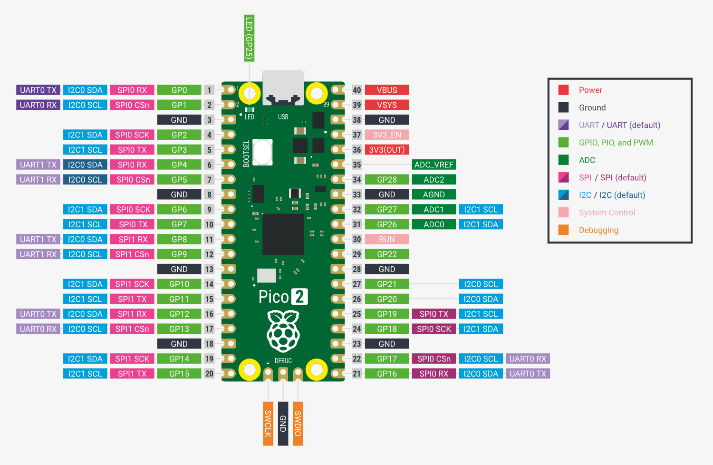

# filter_controller
Simple controller for a pool filter. The programm is run on a raspberry pi pico2.
## requirements
- picotool
## flashing
To Flash your application onto the Pico 2, press and hold the BOOTSEL button. While holding it, connect the Pico 2 to your computer using a micro USB cable. You can release the button once the USB is plugged in.
```bash
cargo run
```
## pins
- GPIO 0: relay controll (level_low)
- GPIO 1: relay controll (level_low)
- GPIO 2: float_sensor (pull_up)

